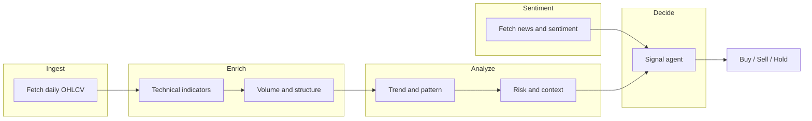
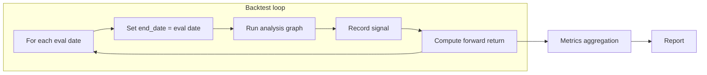

# N2N Agentic Workflow for Indian Market – Daily Chart + Sentiment to Buy/Sell

## Scope

- **Market**: Indian equities (NSE primary; BSE optional). Symbols use Yahoo convention: NSE `SYMBOL.NS`, BSE `SYMBOL.BO` (e.g. `RELIANCE.NS`, `TCS.NS`, `HDFCBANK.NS`). Indices: `^NSEI` (Nifty 50), `^BSESN` (Sensex).
- **Data**: Free-first (no API keys to start); later plug in paid providers without changing workflow.
- **Sentiment**: Dedicated sentiment node feeding into the final decision (free: news + FinBERT; paid later).

**Phase 1 (start here)**: Use **only free data** (yfinance, free sentiment) to build and **backtest** the pipeline. No live broker execution; signals are logged and evaluated via backtest. Validate rules and indicators before adding paid data or execution.

**Phase 2 (later)**: Optional paid data (Alpha Vantage, EODHD, TwelveData, etc.), broker integration (Zerodha Kite / Upstox / Alpaca), position sizing execution, and notifications.

---

## Orchestration: n8n

The **entire agentic workflow runs in n8n**. n8n provides the graph (nodes and edges), execution, and UI. State is passed as **JSON** between nodes (each node’s output becomes the input of the next; use Merge nodes to combine branches).

- **Heavy logic in Python**: Data (yfinance, cache), indicators (pandas/ta), and sentiment (FinBERT, news) stay in a **Python API service** that n8n calls via **HTTP Request** nodes. This avoids reimplementing pandas/FinBERT in n8n’s Code node (JavaScript).
- **Flow and LLM in n8n**: Sequencing, branching, merging, the **OpenAI** (or similar) node for the signal agent, and the backtest loop are all in n8n workflows.
- **Benefits**: Visual editing, retries, logging, and easy addition of triggers (schedule, webhook, manual params). Same Python services can be used by a CLI or other tools.

---

## Workflow architecture (with sentiment)




N1 and N3s can run in parallel (same state, independent fields); for a first version run N3s after N3 (sequential). Parallel can be added when the graph runner supports it.

- **Node 1 – Fetch daily chart**: Pull daily OHLCV via a **data provider** (free: yfinance for `.NS`/`.BO`; paid later: TrueData, etc.). Output: `ohlcv` DataFrame, `raw_fetch_metadata`.
- **Node 2 – Technical indicators**: Full set (trend: SMA/EMA 20/50/200, ADX, Ichimoku, Parabolic SAR; momentum: RSI, MACD, Stochastic, CCI, ROC; volatility: Bollinger, ATR, Keltner; volume: OBV, A/D, MFI, Chaikin; support/resistance: pivots, swing high/low). Output: series + indicator columns; `indicators` dict with last values for prompts and rules.
- **Node 3 – Volume / structure**: Average volume, volume vs avg; simple structure (e.g. higher highs/lows). Output: `volume_summary`, `structure_summary`.
- **Node 3s – Sentiment**: Fetch news (free: RSS/GNews + FinBERT; paid later: NewsAPI, etc.), score and label. Output: `sentiment` (score, label, snippets).
- **Node 4 – Trend / pattern**: Rule-based or small analyst agent from series + indicators. Output: `trend_summary`, `pattern_flags`.
- **Node 5 – Risk / context**: ATR-based volatility, regime. Output: `risk_summary`, `volatility_regime`.
- **Node 6 – Signal agent**: LLM with full state (price, indicators, trend, risk, **sentiment**) to output **Buy / Sell / Hold** plus rationale. Output: `signal` (action, confidence, reason).

State in n8n is the **JSON payload** flowing between nodes; the Python API accepts and returns JSON (e.g. OHLCV as array of bars, indicators as key-value, sentiment as object).

---

## n8n workflow design (node mapping)

Each logical step is implemented as one or more n8n nodes. Python handles steps that need pandas/ta/FinBERT; n8n handles flow and LLM.


| Logical step                            | n8n node(s)                                                 | Implementation                                                                                                                                                                                                       |
| --------------------------------------- | ----------------------------------------------------------- | -------------------------------------------------------------------------------------------------------------------------------------------------------------------------------------------------------------------- |
| **Trigger**                             | Webhook, Schedule, or Manual (input: symbol, lookback_days) | User or cron supplies `symbol`, `lookback_days`; resolve symbol to `RELIANCE.NS` in first HTTP or Code node.                                                                                                         |
| **N1 Fetch OHLCV**                      | HTTP Request                                                | `GET` (or `POST`) Python API `{{ $env.API_BASE }}/ohlcv?symbol=RELIANCE&start=...&end=...`. Returns `{ ohlcv: [...], symbol, raw_fetch_metadata }`.                                                                  |
| **N2+N3 Indicators + volume/structure** | HTTP Request                                                | `POST` Python API `/enrich` with body `{ ohlcv, symbol }`. Returns `{ ohlcv_with_indicators, indicators (last values), volume_summary, structure_summary }`.                                                         |
| **N3s Sentiment**                       | HTTP Request                                                | `GET` or `POST` Python API `/sentiment?symbol=RELIANCE&company_name=...&lookback_days=7`. Returns `{ score, label, snippets, source }`. Can run in parallel with N1→N2→N3 then Merge.                                |
| **N4 Trend**                            | Code node or HTTP                                           | Code node: read `indicators` and `ohlcv` from previous nodes, compute trend summary and pattern flags (simple rules), output `{ trend_summary, pattern_flags }`. Or Python `/trend` endpoint.                        |
| **N5 Risk**                             | Code node or HTTP                                           | Same: from `indicators` (ATR) and ohlcv, output `{ risk_summary, volatility_regime }`. Or Python `/risk` endpoint.                                                                                                   |
| **N6 Signal**                           | OpenAI node (or HTTP to OpenAI)                             | Build prompt from merged data: trend_summary, indicators, risk_summary, sentiment (score, label, snippets). System + user message; parse response for `action`, `confidence`, `reason` (structured output or regex). |
| **Output**                              | Set / Respond to Webhook / Store                            | Return or store `{ signal, symbol, date, ... }`.                                                                                                                                                                     |


**State flow**: Use n8n’s “Merge” node (e.g. Combine mode) to join the chain (N1→N2/N3→N4→N5) with the sentiment branch (N3s), then pass merged JSON into N6. Each node reads from `$input.item.json` (or expression) and adds its result so the payload grows along the chain.

**Python API (FastAPI)** – minimal endpoints:

- `GET /ohlcv?symbol=&start=&end=` → resolve symbol (e.g. RELIANCE → RELIANCE.NS), call data provider, cache; return OHLCV as JSON array + metadata.
- `POST /enrich` body `{ ohlcv, symbol }` → compute indicators (ta/pandas), volume/structure summaries; return enriched object.
- `GET /sentiment?symbol=&company_name=&lookback_days=` → news + FinBERT; return SentimentResult as JSON.
- Optional: `POST /trend`, `POST /risk` if you prefer not to use Code nodes for N4/N5.
- `POST /backtest` body `{ symbol, start, end, lookback_days, hold_days, step_days }` → run loop internally, return `{ metrics, rows }`. n8n can call this in one shot for backtest, or n8n Loop Over Items (dates) + multiple `/ohlcv` + `/enrich` + … and then `POST /metrics` with collected signals + forward returns.

---

## Backtesting agent

The **backtesting agent** is not a node inside the main DAG; it is an **orchestrator** that reuses the same analysis graph over historical time to evaluate how signals would have performed.




**Flow:**

1. **Rolling windows**: For each evaluation date in a backtest range (e.g. weekly or daily), set `end_date = evaluation_date` and `start_date = end_date - lookback_days` (e.g. 90). This ensures point-in-time: the workflow only sees data available on that date.
2. **Run graph**: Execute the full pipeline (N1→…→N6) once per evaluation date; collect `signal` (action, confidence, reason) and the date.
3. **Forward returns**: For each date where the signal was BUY or SELL, compute actual return over a holding period (e.g. 1, 5, or 20 trading days) using future OHLCV from the cache or data provider.
4. **Metrics**: Aggregate across all evaluation dates:
  - **By signal**: Win rate, average return, and count for BUY vs SELL vs HOLD.
  - **Portfolio-style**: If you simulate a simple strategy (e.g. long on BUY, flat on HOLD, short or flat on SELL), compute total return, Sharpe ratio (or sortino), max drawdown, number of trades.
  - **Confusion-style**: Optional – compare BUY/SELL to “correct” direction (e.g. forward return > 0 = positive), for accuracy / precision / recall.
5. **Output**: Summary report (console + optional CSV/JSON) and optionally a small **review agent** (LLM or rules) that summarizes “what worked / what didn’t” for the symbol and period.

**Design choices (with n8n):**

- **Option A – Backtest in Python**: Single `POST /backtest` runs the date loop server-side, uses same data/enrich/sentiment, gets signal per date (in-process LLM or n8n webhook), returns `{ metrics, rows }`. n8n triggers it and displays/stores the result.
- **Option B – Backtest loop in n8n**: "Loop Over Items" (evaluation dates) → each iteration HTTP to `POST /run_analysis` → then `POST /metrics` with collected results. More visible, more round-trips.
- **Recommendation**: Start with Option A for cache efficiency. Optional review agent: OpenAI node in n8n after metrics, or in Python in `/backtest` response.
- **Backtest runner** (Python): `src/backtest/runner.py` + `metrics.py`; called by `POST /backtest` (e.g. 5 = evaluate every 5 trading days to reduce cost). Uses the same `WorkflowState` and graph; for each step, builds state with the appropriate date window, runs the graph, records `(date, signal, forward_return)`.
- **Evaluation module** (e.g. `src/backtest/metrics.py`): Pure functions: given a list of `(date, signal, forward_return)`, compute win rate, avg return, Sharpe, max drawdown, trade count. No LLM.
- **Optional review agent**: A separate step or node that takes the metrics + a sample of signals/reasons and produces a short narrative summary (e.g. “BUY signals underperformed in high-volatility periods”); can be a final LLM call or a template.

**CLI:** Optional script calls Python API or n8n webhook for backtest.

---

## 1. Indian market – free data first, paid later

### 1.1 Symbol and exchange

- **NSE**: suffix `.NS` (e.g. `RELIANCE.NS`, `INFY.NS`, `HDFCBANK.NS`). Primary liquid exchange; use by default.
- **BSE**: suffix `.BO`. Use for BSE-only or dual listing.
- **Indices**: `^NSEI` (Nifty 50), `^BSESN` (Sensex) for market context.
- **Symbol map**: Keep CSV or dict mapping user input to Yahoo symbol (e.g. `RELIANCE` → `RELIANCE.NS`) so CLI accepts `--symbol RELIANCE`. NSE symbol list: [nseindia.com](https://www.nseindia.com/market-data/securities-available-for-trading) or [EQUITY_L.csv](https://archives.nseindia.com/content/equities/EQUITY_L.csv).

### 1.2 Data collection (daily OHLCV) and provider abstraction

**Data scope**: Fetch daily **Open–High–Low–Close–Volume** bars per stock. Store **at least several years** of history to enable backtesting (e.g. 5–10 years). Use HTTP Request nodes in n8n (or the Python API) to call the data source and parse JSON; Python API returns a consistent JSON shape regardless of provider.

**API options** (configurable via provider registry):

- **Free (Phase 1)**: **Yahoo Finance (yfinance)** – no API key; good for `.NS`/`.BO` and indices; reasonable rate limits. Optional: **nsepy**, **NseIndiaApi**, **NSEDownload** for NSE-only (can break when NSE changes their site).
- **Paid / free-tier (Phase 2 or optional)**: **Alpha Vantage** (200K+ tickers, global daily OHLCV), **EOD Historical Data** (60+ exchanges, deep history), **Twelve Data**, **Finnhub**. IEX Cloud closed in 2025. Choose by coverage and cost; all consumed via the same provider interface.

**Provider abstraction**:

- **Interface** (e.g. `src/data/providers/base.py`): `get_daily_ohlcv(symbol: str, start: date, end: date) -> pd.DataFrame` with columns `Open, High, Low, Close, Volume` (optional `Adj Close`), index = DatetimeIndex.
- **Free implementation**: **yfinance** – `yf.download(symbol, start=..., end=..., auto_adjust=True)`. Primary for Phase 1.
- **Paid later**: Register `AlphaVantageProvider`, `EODHDProvider`, `TwelveDataProvider`, etc.; choose via config (e.g. `DATA_PROVIDER=yfinance` or `alphavantage`).
- **Caching**: Cache raw OHLCV by (symbol, date range). Parquet or SQLite under `data/cache/`. Same-day refresh once per run; historical bars long-term. Essential for backtest (avoid re-fetching same ranges). Cache key uses resolved symbol (e.g. `RELIANCE.NS`).

### 1.3 Config and env (see also Section: Scalability and configurability)

- **Config**: `default_exchange` (NSE), `symbol_suffix` (`.NS`), symbol list path, `cache_dir`, `cache_ttl_days`, `data_provider` (`yfinance` | future).
- **Env**: `DATA_PROVIDER`, `CACHE_DIR`; for paid: `TRUEDATA_API_KEY`, etc. No keys for yfinance.

---

## 2. Sentiment analysis – free first, paid later

### 2.1 Role in the workflow

- **Sentiment node (N3s)** produces a summary for the symbol (and optionally sector/index) and attaches it to state.
- **Signal agent (N6)** receives price/indicators, trend, risk, **and sentiment**, and outputs BUY/SELL/HOLD with reason.

### 2.2 Sentiment provider abstraction

- **Interface** (e.g. `src/sentiment/providers/base.py`): `get_sentiment(symbol: str, company_name: Optional[str], lookback_days: int) -> SentimentResult` with `SentimentResult`: `score: float` (-1 to 1 or 0–1), `label: str` (e.g. positive/neutral/negative), `snippets: list[str]`, `source: str`.
- **Free implementation**:
  - **News**: RSS (MoneyControl, Economic Times, NSE announcements if public) via `feedparser` + `requests` + BeautifulSoup; or **GNews API** free tier (e.g. 100 req/day) with query `"{company_name} stock"` or `"{symbol} NSE"` for last N days.
  - **Scoring**: **FinBERT** (HuggingFace `ProsusAI/finbert`) or distilbert fine-tuned for sentiment on headline+snippet; aggregate to one `score` and `label` per symbol. No API key; runs locally.
  - **Fallback**: If no articles, set `label: "neutral"`, `score: 0.0`.
- **Paid later**: NewsAPI, Benzinga, Alpha Vantage news, Dalal Street AI–style APIs. Implement `NewsAPISentimentProvider`, etc.; switch via `SENTIMENT_PROVIDER` and env keys.
- **Symbol → company name**: Maintain a small map (e.g. RELIANCE → "Reliance Industries", TCS → "TCS") for better news search; CSV or from free NSE/BSE listing data.

---

## 2.5 Technical indicators (daily)

Compute a **broad set** of indicators (trend, momentum, volatility, volume, support/resistance) so the decision layer has rich, complementary inputs. Use a dedicated library (e.g. **TA-Lib**, **pandas-ta**) in the Python enrich service for accuracy; expose which indicators to compute via **config** (feature flags and parameters).

**Trend**: Simple/Exponential Moving Averages (e.g. 20, 50, 200-day SMA/EMA), **ADX** (Average Directional Index) for trend strength, **Ichimoku Cloud** (trend and support/resistance), **Parabolic SAR** (reversal points).

**Momentum oscillators**: **RSI**, **MACD**, **Stochastic Oscillator**, **CCI** (Commodity Channel Index), **ROC** (Rate of Change), **Momentum** (lag-0 price change). These signal overbought/oversold and trend changes.

**Volatility**: **Bollinger Bands** (e.g. ±2σ), **ATR** (Average True Range) for volatility and stop sizing, **Keltner Channels** (ATR-based bands). High volatility suggests wider stops or smaller position sizes.

**Volume**: **OBV** (On-Balance Volume), **Accumulation/Distribution Line**, **Money Flow Index (MFI)**, **Chaikin Money Flow**. Volume confirms whether price moves are supported.

**Support/Resistance and structure**: **Pivot points**, recent **swing high/low** (e.g. 30-day support/resistance), higher highs / higher lows for trend structure. Optional: multi-day returns for context.

**Implementation**: Python `/enrich` (or equivalent) computes these from clean daily OHLCV; return last values + optional series for charts. Config specifies which indicators are enabled and their params (e.g. RSI period 14, SMA windows 20/50/200). Best practice: combine 2–4 complementary indicators (e.g. trend + momentum + volume) rather than relying on one.

---

## 3. Shared state schema (detailed)

Single Pydantic model (or dataclass) passed through the graph.

- **Input**: `symbol: str` (resolved, e.g. `RELIANCE.NS`), `start_date`, `end_date`, `company_name: Optional[str]`.
- **After N1**: `ohlcv: pd.DataFrame`, `raw_fetch_metadata: dict`.
- **After N2**: `ohlcv` with indicator columns; `indicators: dict` (e.g. `{"rsi": 55.2, "macd_hist": 0.3}`) for prompts.
- **After N3**: `volume_summary: str`, `structure_summary: str`.
- **After N3s**: `sentiment: SentimentResult`.
- **After N4**: `trend_summary: str`, `pattern_flags: list[str]`.
- **After N5**: `risk_summary: str`, `volatility_regime: str`.
- **After N6**: `signal: Signal` with `action: Literal["BUY","SELL","HOLD"]`, `confidence: float`, `reason: str`.

In **n8n**, each node receives the incoming JSON and adds its output; the Python API uses the same field names and returns JSON (OHLCV as list of objects, no DataFrame in the wire format).

---

## 4. Node-by-node specification


| Node                    | Input from state             | Action                                                                                                                                                                                 | Output to state                           |
| ----------------------- | ---------------------------- | -------------------------------------------------------------------------------------------------------------------------------------------------------------------------------------- | ----------------------------------------- |
| **N1 Fetch**            | symbol, start_date, end_date | Resolve symbol (RELIANCE → RELIANCE.NS), call data provider, optional cache                                                                                                            | ohlcv, raw_fetch_metadata                 |
| **N2 Indicators**       | ohlcv                        | Full set: SMA/EMA, ADX, Ichimoku, Parabolic SAR, RSI, MACD, Stochastic, CCI, ROC, Bollinger, ATR, Keltner, OBV, A/D, MFI, Chaikin, pivots, swing levels (see §2.5); params from config | ohlcv + columns, indicators (last values) |
| **N3 Volume/structure** | ohlcv                        | Avg volume, volume vs avg; HH/HL structure (e.g. last 5/20 days)                                                                                                                       | volume_summary, structure_summary         |
| **N3s Sentiment**       | symbol, company_name         | Call sentiment provider (news + FinBERT)                                                                                                                                               | sentiment                                 |
| **N4 Trend**            | ohlcv, indicators            | Rule-based trend from SMAs, crossovers; optional LLM summary                                                                                                                           | trend_summary, pattern_flags              |
| **N5 Risk**             | ohlcv, indicators (ATR)      | ATR %, volatility regime, optional position-size hint                                                                                                                                  | risk_summary, volatility_regime           |
| **N6 Signal**           | All above                    | LLM prompt: price + indicators + trend + risk + sentiment → structured (action, confidence, reason); optional rule overlay                                                             | signal                                    |


---

## 5. Project structure (n8n + Python API)

```
StockAnalysis/
  config/
    symbols.csv           # symbol, yahoo_symbol, company_name, exchange
    config.yaml           # schema: providers, symbols path, analysis params, LLM, backtest, API
    schema.py or schema.json  # optional: Pydantic schema for config validation
  data/
    cache/                # Parquet or SQLite for OHLCV cache
  src/                    # Python API (FastAPI) + shared logic
    api/
      main.py             # FastAPI app: /ohlcv, /enrich, /sentiment, /metrics, /backtest
      routes/
        ohlcv.py
        enrich.py
        sentiment.py
        backtest.py
    state.py              # Pydantic models for request/response JSON
    data/
      providers/
        base.py            # DataProvider protocol
        registry.py        # register(name, provider_class); get(name) from config
        yahoo.py
        # truedata.py, twelve_data.py (register in registry)
      cache.py             # abstract cache backend: local, Redis (for multi-worker)
    sentiment/
      providers/
        base.py
        registry.py        # same pattern: register/get by config name
        free_news_finbert.py
    analysis/             # Reusable logic (used by API and optionally by backtest)
      indicators.py
      volume_structure.py
      trend.py
      risk.py
    backtest/
      runner.py           # Date loop, call analysis + optional n8n webhook per date
      metrics.py
  n8n/
    workflows/            # Export n8n JSON workflows (optional; or build in UI)
    stock_analysis_workflow.json
    stock_backtest_workflow.json
  run.py                  # Optional CLI: calls API or triggers n8n webhook
  requirements.txt
  .env.example            # API_BASE (for n8n), DATA_PROVIDER, CACHE_DIR, OPENAI_API_KEY, SENTIMENT_PROVIDER, N8N_WEBHOOK_ANALYSIS, N8N_WEBHOOK_BACKTEST
```

**n8n**: Run n8n self-hosted or n8n Cloud. Set `API_BASE` (e.g. `http://localhost:8000`) in n8n env so HTTP Request nodes point to your Python API. Workflows can be exported as JSON and versioned under `n8n/workflows/`.

---

## 6. Scalability and configurability

### 6.1 Scalability

- **Stateless Python API**: Every endpoint (e.g. `/ohlcv`, `/enrich`, `/sentiment`, `/backtest`) receives all required parameters in the request; no server-side session or in-memory workflow state. Enables horizontal scaling: run multiple API instances behind a load balancer; add/remove replicas by load.
- **Cache as single source of truth**: OHLCV cache (e.g. Parquet or Redis) is shared across instances. Use a **distributed cache** (Redis, S3 + local cache) when running multiple API workers so they do not duplicate fetches.
- **Backtest and batch**: For many symbols or long backtest ranges, avoid blocking one request. Options: (1) **Async** – `POST /backtest` runs the date loop asynchronously, returns a `job_id`; `GET /backtest/status/{job_id}` or webhook returns metrics when done. (2) **Queue** – push backtest jobs to a queue (e.g. Redis, SQS); worker(s) consume and write results to DB or object store; n8n polls or receives webhook. (3) **Chunking** – n8n "Loop Over Items" with batches of symbols or date ranges; each item triggers one API call; keep payloads small.
- **n8n scaling**: n8n can run in multi-worker mode (see n8n docs); workflows are stateless per execution. Rate-limit outgoing HTTP calls to the Python API if you run many concurrent workflows (e.g. one symbol per execution, or batch size in config).
- **Resource limits**: Configurable timeouts and max rows per request (e.g. `max_lookback_days`, `max_backtest_dates`) to avoid runaway backtests; reject or truncate in the API.

### 6.2 Configurability

- **Single source of config**: One **config schema** (e.g. YAML or JSON) plus **env vars** for secrets and overrides. Load at startup; validate with Pydantic so invalid config fails fast. Structure:
  - **Providers**: `data_provider`, `sentiment_provider`, optional `llm_provider` (if LLM runs in Python). Per-provider settings (e.g. `yfinance: { cache_ttl_days: 1 }`, `truedata: { api_key_env: TRUEDATA_API_KEY }`).
  - **Symbols**: Path to `symbols.csv` or list; optional per-symbol overrides (e.g. `exchange`, `company_name`).
  - **Analysis**: Indicator params (e.g. RSI period, MACD params), trend/risk thresholds, which indicators to enable (feature flags).
  - **LLM**: Model name, temperature, max tokens; prompt template path or inline (for signal agent and optional review agent).
  - **Backtest**: Defaults for `lookback_days`, `hold_days`, `step_days`; optional job queue URL and timeouts.
  - **API**: Port, workers, timeouts, CORS; cache backend (local, Redis).
- **Pluggable providers**: **Registry pattern** – data and sentiment providers register by name (e.g. `yfinance`, `truedata`, `free_news_finbert`, `newsapi`). Config chooses which to use; no code change to add a new provider, only a new class and registration. Same for optional "signal strategy" (LLM vs rule-based) if you later support both.
- **Overrides**: Env vars override config file (e.g. `DATA_PROVIDER=truedata`). Optional: query or body params on API (e.g. `?data_provider=truedata`) for one-off runs without redeploy; validate against allowed list.
- **n8n**: Use n8n expressions and env (e.g. `{{ $env.API_BASE }}`, `{{ $env.LOOKBACK_DAYS }}`) so the same workflow can target different environments or params without editing the workflow JSON.

### 6.3 Summary


| Concern                    | Approach                                                    |
| -------------------------- | ----------------------------------------------------------- |
| Scale API                  | Stateless FastAPI; multiple workers; load balancer          |
| Scale backtest             | Async job + poll/webhook, or queue + workers                |
| Scale cache                | Shared cache (Redis or S3); cache key = symbol + date range |
| Add provider               | Implement interface; register in registry; add config entry |
| Change thresholds / params | Edit config YAML or env; restart or hot-reload if supported |
| Per-run overrides          | API query/body params (allowlisted); n8n input params       |


---

## 7. Why n8n

- **Single orchestration layer**: All flow control, retries, and visibility in one place (n8n UI).
- **Python for heavy work**: Data, indicators, sentiment, and backtest metrics stay in Python (pandas, ta, FinBERT); n8n does not need to reimplement these.
- **LLM in n8n**: Use the built-in OpenAI (or similar) node for the signal agent; no need to host a separate LLM service in Python unless you prefer it.
- **Triggers**: Webhook (from CLI or external app), schedule (e.g. daily after market close), or manual with parameters.
- **Extensibility**: Add Slack/Email nodes for alerts, or storage nodes to log signals, without changing Python.

**Local n8n setup**: n8n runs on your machine (e.g. Docker `n8n/n8n` or `npm install -g n8n`). Default UI: `http://localhost:5678`. Set n8n env **API_BASE** to your Python API URL so HTTP Request nodes hit the right host: use `http://localhost:8000` if the API runs on the same host; use `http://host.docker.internal:8000` if n8n runs in Docker and the API runs on the host. Start the Python API first, then run the workflow from n8n.

---

## 8. Decision logic (buy/sell/hold)

Combine indicators via **rule-based** and/or **ML** and/or **LLM (hybrid)**. Support at least one mode in Phase 1 (e.g. rule-based + LLM); add ML later if desired.

**Structured output** (all modes): `action: Literal["BUY","SELL","HOLD"]`, `confidence: float`, `reason: str`. Optional: `stop_loss`, `take_profit` for execution phase.

**Rule-based signals**: Define explicit entry/exit rules in config. Examples: “Buy when RSI < 30 and price > 200-day SMA and MACD bullish crossover; Sell when RSI > 70 or MACD bearish crossover.” Use 2–4 complementary indicators (e.g. trend + momentum + volume). Implement as a decision tree in n8n IF nodes or in Python: e.g. if “momentum up, trend up, volume confirms” → BUY. Rules are transparent and easy to backtest. Config holds thresholds (RSI oversold/overbought, SMA cross levels, etc.).

**Machine learning (optional, Phase 2)**: Train a classifier (e.g. **XGBoost**, **Random Forest**) on historical indicator features to predict next-day return sign or magnitude. Features: recent returns, RSI, MACD, volatility, volume, etc. Requires 5–10 years of data and careful cross-validation to avoid lookahead bias. Compare ML vs rule-based baseline in backtest. Deep learning (LSTM, Transformers) is possible for sequence modelling but needs more data and tuning.

**Hybrid / AI agent (Phase 1)**: Feed structured data (indicators, trend, risk, sentiment) to an **LLM** that outputs BUY/SELL/HOLD + reason in JSON. The AI acts as **context evaluator**, not pure price predictor. Use n8n OpenAI node with a prompt that includes trend_summary, key indicator values, risk_summary, and sentiment (score, label, snippets). Parse response into the structured schema. Optional rule overlay (e.g. RSI > 80 → force no BUY) as a safeguard before or after the LLM.

**Config**: Which mode to use (rule / ml / hybrid), rule thresholds, and (if ML) model path or training params.

---

## 9. Risk management

Apply risk controls so capital is protected even when signals are wrong. Phase 1 can **compute** position size and stop levels (for backtest and display); **live execution** of orders is Phase 2.

**Position sizing**: Risk a fixed fraction per trade (e.g. **1–2%** of account). Formula: `position_size = (account_balance * risk_pct) / (stop_distance_per_share)`. Set **stop-loss first**, then derive size so that if stop is hit, loss is capped at that percent. Example: equity ₹10L, risk 1% → ₹10k at risk; if stop = 5% below entry, then size = (0.01 × 10L) / (0.05 × price). Config: `risk_pct`, optional `max_position_pct` of account.

**Stop-loss and take-profit**: Use **hard stops** (e.g. ATR×2, or support levels). Optional: **trailing stop** (e.g. 1.5×ATR), **take-profit** (e.g. 2:1 reward-to-risk). These can be computed in the signal/risk node and passed to the execution step (Phase 2). ATR from indicators enables volatility-based stops.

**Portfolio limits**: Avoid over-concentration. Config: max % per sector (e.g. 20%), max % per stock (e.g. 5%). Before sending an order, check current portfolio (via API or DB); n8n IF node can block execution if the new trade would exceed limits.

**Drawdown controls (optional)**: “Circuit breakers” – e.g. stop trading for the day if daily PnL < -X%, or pause if month-to-date drawdown > Y%. Implement in n8n: IF (cumulative loss from logged trades > threshold) → skip order placement. Config: `max_daily_loss_pct`, `max_mtd_drawdown_pct`.

**Pre-trade checks**: Verify buying power and existing orders. If account size and open trades plus new signal would exceed max allocation, skip execution. Workflow can fetch portfolio state via broker API or DB and use an IF node to block over-exposure.

---

## 10. Execution and integration (Phase 2)

**Broker and execution**: Use a broker API for live orders. **India**: Zerodha Kite, Upstox (REST API; store credentials in n8n). **Paper / global**: Alpaca (free paper trading). n8n HTTP Request node: POST to broker order endpoint with side, qty, symbol, order type (market/limit). Ensure idempotency (e.g. record “order placed” in DB before sending; IF checks to avoid duplicate orders).

**Logging**: Record every **signal** and every **executed trade**. Use n8n MySQL/PostgreSQL node or Google Sheets: table/columns for date, symbol, price, qty, entry/exit, PnL, signal reason. Essential for review and backtest comparison.

**Notifications**: Slack, Telegram, or Email node after execution (e.g. “Bought 100 RELIANCE at ₹2,500”). Optional: notify on signal even when not executed (e.g. “BUY signal; skipped – portfolio limit”).

**Scaling and monitoring**: Run n8n with retry logic; use error triggers or try/catch to alert on failure (e.g. data API down, order rejected). Keep workflow idempotent so re-runs do not duplicate trades.

---

## 11. n8n full workflow (node-by-node flow)

High-level flow matching the described pipeline (Phase 1 stops at “log signal”; Phase 2 adds execution and notify):

```
Cron (e.g. 5:30pm IST after market close)
    ↓
HTTP Request (fetch OHLCV via Python API)
    ↓
HTTP Request or Code (clean data, compute indicators → /enrich)
    ↓
HTTP Request (sentiment → /sentiment); Merge with above
    ↓
Code or HTTP (trend, risk summaries)
    ↓
IF Node (Buy condition true?)
  ├─ yes → [Phase 2: Code (position size) → HTTP (broker order) → DB log → Notify]
  └─ no  → IF Node (Sell condition true?)
            ├─ yes → [Phase 2: Code (position size) → HTTP (broker order) → DB log → Notify]
            └─ no  → Hold (log signal only, no order)
    ↓
Database / Sheets (log signal: symbol, date, action, reason, indicators)
    ↓
[Phase 2: Notification (Slack/Telegram/Email)]
```

**Cron**: Schedule daily (e.g. after close). **HTTP (OHLCV)**: Call `GET /ohlcv?symbol=...&start=...&end=...`. **Code/HTTP (indicators)**: `POST /enrich` with OHLCV. **IF nodes**: Evaluate rule-based buy/sell from indicator values (and optionally LLM output). **Position sizing (Phase 2)**: Code node: `size = (balance * risk_pct) / (stop_distance * price)`. **Execution (Phase 2)**: HTTP to broker API. **Log**: Every signal and trade to DB or Sheets. **Notify (Phase 2)**: Alert on execution or signal.

---

## 12. References and best practices

- **Combine indicators**: Use 2–4 complementary indicators (e.g. trend + momentum + volume); don’t rely on one (Investopedia).
- **Reliable data**: Use consistent, quality sources; cache aggressively; if using free tiers (e.g. Alpha Vantage limit), rotate or cache to stay within limits.
- **Backtest and validate**: Backtest rules/ML on historical data before live trading. Avoid lookahead bias (indicators must use only past data). Walk-forward and out-of-sample validation recommended.
- **Risk-first**: Position sizing and stops are non-negotiable. Even a good signal is dangerous without risk caps (e.g. 2% per trade allows ~50 consecutive losses before wipeout – QuantInsti).
- **Documentation and logging**: Version workflows, note parameter changes, log every decision. Builds a research database for what worked and what didn’t.

---

## 13. Implementation order

**Phase 1 (free data, backtest only)**

1. **Config and registry**: Config schema (YAML + Pydantic); provider registries for data and sentiment; env overrides.
2. **Data layer**: Provider interface, **yfinance only** (free), symbol resolution (NSE), cache. Store several years of OHLCV for backtest. `GET /ohlcv`.
3. **Enrich**: **Full indicator set** (trend: SMA/EMA, ADX, Ichimoku, Parabolic SAR; momentum: RSI, MACD, Stochastic, CCI, ROC; volatility: Bollinger, ATR, Keltner; volume: OBV, A/D, MFI, Chaikin; support/resistance: pivots, swing levels). Use pandas-ta or TA-Lib; config to enable/disable and set params. `POST /enrich`.
4. **Sentiment**: Free path (RSS/GNews + FinBERT). `GET /sentiment`.
5. **Python API**: FastAPI with `/ohlcv`, `/enrich`, `/sentiment`, `/trend`, `/risk`; stateless.
6. **Decision logic**: Rule-based (IF nodes or Python) + optional LLM (OpenAI node); configurable thresholds.
7. **n8n analysis workflow**: Cron or manual → HTTP /ohlcv → HTTP /enrich → HTTP /sentiment → Merge → trend/risk → IF (Buy?) / IF (Sell?) → **log signal to DB/Sheets** (no broker in Phase 1).
8. **Backtest**: `POST /backtest`; point-in-time windows, forward returns, metrics (win rate, Sharpe, drawdown). Validate on free data.
9. **n8n backtest workflow**: Trigger → HTTP `POST /backtest` → report.

**Phase 2 (optional)**

1. **Risk node**: Position sizing (1–2% risk, stop-first), portfolio limits, circuit breakers; Code node or Python.
2. **Execution**: Broker API (Zerodha Kite / Upstox / Alpaca); HTTP node; idempotency and pre-trade checks.
3. **Logging and notifications**: DB/Sheets for trades; Slack/Telegram/Email on execution.
4. **Paid data**: Add Alpha Vantage, EODHD, TwelveData, etc. to registry; config switch.
5. **Later**: ML model (XGBoost/RF) for signal; multiple workers; queue-based backtest.

