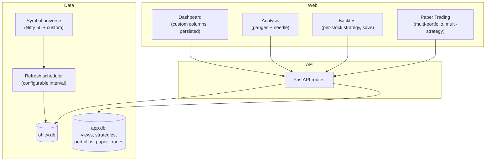

# Stock Analysis Web App – Re-architecture Plan

## Current state (summary)

- **Data**: OHLCV cached in SQLite (`data/cache/ohlcv.db`) on demand; symbols come from `config/symbols.csv` (currently ~10 symbols). Dashboard shows “all stocks in cache” (so whoever was queried).
- **No scheduler**: Data is fetched only when API is called.
- **Dashboard**: Fixed columns (Close, SMA 20/50, RSI, MACD Hist, Signal, Reason); no persistence.
- **Analysis**: Single-symbol; indicators in lists + charts; one text signal (BUY/SELL/HOLD).
- **Backtest**: Single symbol, single hardcoded rule-based strategy (RSI + MACD + SMA200); no strategy save or per-stock choice.
- **No paper trading**.

---

## Target architecture (high level)

---

## 1. Data layer: Nifty 50 by default + auto-refresh

**1.1 Symbol universe**

- **Default universe**: Nifty 50 list as the canonical set. Add `config/nifty50.csv` (or similar) with 50 symbols (symbol, yahoo_symbol, company_name); alternatively keep using `config/symbols.csv` but ensure it contains full Nifty 50 (you can source from NSE or [community lists](https://github.com/hazeyblu/NSE_Yahoo_tickers)).
- **Pre-seed on first run**: On app startup (or dedicated “init” step), if DB is empty or a flag says “seed needed”, fetch daily OHLCV for all symbols in the universe (e.g. last 1–2 years) and write to `ohlcv.db`. Use existing `get_cached_or_fetch` + `write_ohlcv_cache`; loop over universe symbols.
- **Add more stocks**: Allow adding symbols (e.g. via config or a small API/settings UI). Store “universe” in DB or in a file that the app loads so that refresh knows which symbols to update.

**1.2 Auto-refresh (configurable interval)**

- **Scheduler**: Use **APScheduler** (e.g. `BackgroundScheduler` or `AsyncIOScheduler` if you move to async). Start scheduler in FastAPI lifespan; avoid blocking the event loop (run refresh in a thread pool or async task).
- **Config**: In [config/config.yaml](config/config.yaml) add something like:
  - `refresh_enabled: true`
  - `refresh_interval_minutes: 360`  # 6h, or 1440 for daily
  - `refresh_lookback_days: 5`  # how many days to backfill on each run
- **Refresh job**: For each symbol in the universe, fetch OHLCV for the last `refresh_lookback_days` (or since last cached date) and **upsert** into `ohlcv.db` (existing `write_ohlcv_cache` is upsert-style). No need to replace entire history; only fill missing dates.
- **Resilience**: On failure for a symbol, log and continue with others; optional retry with backoff.

**1.3 DB and code touch points**

- Keep [src/data/cache.py](src/data/cache.py) as-is for OHLCV. Add a **universe** concept: either a new table in the same DB or a separate `app.db` (see below). Recommendation: store “universe” list in the new **app DB** (e.g. `symbol_universe` table) so adding/removing symbols is persistent and refresh loops over that list.

---

## 2. App DB: views, strategies, portfolios

Introduce a second SQLite DB (e.g. `data/app.db`) for app state so the main `ohlcv.db` stays focused on market data.

**2.1 Schema (conceptual)**

- **dashboard_views**: `id`, `name`, `user_id` (nullable for single-user), `columns_config` (JSON: list of column keys, order, visibility), `created_at`, `updated_at`. For “restore my views”, one row per saved view (e.g. “Default”, “Momentum focus”).
- **indicators_meta**: Optional table or JSON in config listing available indicator keys and labels for the UI (e.g. `sma_20`, `rsi`, `macd_hist`) so dashboard can show/hide by key.
- **strategies**: `id`, `name`, `description`, `strategy_type` (e.g. `rule_based`), `params` (JSON: e.g. RSI period, thresholds, which rules), `is_global_default` (boolean), `created_at`, `updated_at`.
- **backtest_runs**: Optional; `id`, `strategy_id`, `symbol`, `start_date`, `end_date`, `params`, `metrics` (JSON), `created_at` for history.
- **paper_portfolios**: `id`, `name`, `initial_capital`, `currency`, `created_at`.
- **paper_portfolio_positions**: `portfolio_id`, `symbol`, `strategy_ids` (JSON array of strategy IDs assigned to this stock), `created_at`.
- **paper_trades** (or **paper_equity_snapshots**): `portfolio_id`, `date`, `equity`, `cash`, `positions` (JSON) for time series of portfolio value.

Migrations: use a simple approach (e.g. `sqlite3` + a `schema_version` table and one-off upgrade scripts, or Alembic if you prefer).

**2.2 API for persistence**

- **Dashboard views**: `GET/POST /api/dashboard/views`, `GET/PUT/DELETE /api/dashboard/views/:id`. Return `columns_config` (which indicators to show, order). Frontend sends updates when user adds/removes/reorders columns; server writes to `app.db`.
- **Strategies**: `GET/POST /api/strategies`, `GET/PUT/DELETE /api/strategies/:id`. Support `is_global_default`; only one strategy can be global default at a time. Used by backtest and paper trading.
- **Paper portfolios**: `GET/POST /api/paper/portfolios`, `GET/PUT/DELETE /api/paper/portfolios/:id`, plus endpoints for positions (stocks + strategy mapping) and running paper engine (see below).

---

## 3. Dashboard: all stocks + configurable indicators, persisted

**3.1 Data**

- Dashboard continues to show “all symbols in universe” (or all with data in `ohlcv.db`). Data source: same as today (loop symbols, compute indicators + signal) but only for symbols in the universe so it’s deterministic.

**3.2 Customizable columns**

- **Available columns**: Derive from a fixed list of indicator keys (e.g. close, sma_20, sma_50, sma_200, rsi, macd_hist, atr, signal, reason) plus optional “custom” names. Store in DB as `columns_config`: e.g. `[{ "key": "rsi", "visible": true, "order": 2 }, ...]`.
- **UI**: Table with column headers; “Column settings” or gear icon to open a modal where user can add/remove indicators and reorder. Each change triggers `PUT /api/dashboard/views/:id` (or POST to create a new view). On load, `GET /api/dashboard/views` and apply to table.

**3.3 Restore on launch**

- On app load, call `GET /api/dashboard/views` and restore last-used view (e.g. last updated, or a “default” view). Render table with only the selected columns in the saved order.

---

## 4. Analysis page: indicators as gauges + needle

**4.1 Multiple gauges per indicator**

- For each chosen indicator (e.g. RSI, MACD, Trend, ATR, Bollinger), show a **gauge** (semicircle or full circle) with:
  - A **needle** or segment indicating value (e.g. RSI 0–100, MACD hist normalized, or “strength”).
  - **Zones**: e.g. green (buy/bullish), red (sell/bearish), gray (neutral), with labels “Buy / Sell / Hold” or “Bullish / Bearish / Neutral”.
- Reuse existing interpretation logic (e.g. [static/app.js](static/app.js) `interpretRSI`, `interpretMACD`, `interpretTrend`, etc.) to map value → zone and label. Each gauge shows one indicator’s value and its interpretation.

**4.2 Implementation options**

- **Lightweight**: CSS + SVG gauges (e.g. conic-gradient or SVG arc + rotating needle). No new framework; keep vanilla JS or minimal lib.
- **Library**: Use a small chart library that supports gauge (e.g. ApexCharts gauge, Chart.js with gauge plugin, or TradingView-style multi-gauge demos). Prefer one that fits your current stack (you already use LightweightCharts for price).

**4.3 Layout**

- Analysis tab: keep price/volume and existing charts. Add a **“Indicators”** section with a row of gauges (one per indicator). Optionally add a **summary needle** (single gauge: combined signal BUY/SELL/HOLD) that aggregates the same rule-based logic you use today.

**4.4 API**

- No new API required; enrich response already returns `indicators` and you derive signal on frontend. Frontend passes indicator values into gauge components and uses existing `interpret`* helpers for zone/needle.

---

## 5. Backtest: highly customizable, per-stock strategy, save strategy

**5.1 Strategy model**

- **Strategy** = named entity in DB: name, description, `strategy_type`, `params` (JSON).
  - Example `params`: `{ "rules": "rsi_macd_sma200", "rsi_period": 14, "rsi_buy_below": 30, "rsi_sell_above": 70, "macd_...": ... }`. First version can keep a single rule set (current RSI+MACD+SMA200) with configurable thresholds; later add more rule sets (e.g. “momentum_only”, “trend_follow”).
- **Global default (template)**: One strategy marked `is_global_default`. When user adds a stock in backtest (or paper) without picking a strategy, use this default. UI can show “Strategy: [Default] RSI+MACD” and allow override per stock.

**5.2 Backtest UI/API**

- **Multi-symbol backtest**: User selects multiple symbols (e.g. Nifty 50 or a subset). For each symbol, user can select a strategy (dropdown: saved strategies + “Global default”). Payload: e.g. `{ "symbols": ["RELIANCE", "TCS"], "strategy_assignments": { "RELIANCE": "strategy_uuid_1", "TCS": "global_default" }, "start", "end", "lookback_days", "hold_days", "step_days" }`.
- **Backend**: For each symbol, resolve strategy (from `strategy_assignments` or global default), load params, run existing `run_backtest` with a **strategy-aware** `run_analysis` that uses that strategy’s rules/params. Aggregate metrics across symbols (e.g. combined equity curve, aggregate win rate, per-symbol breakdown).
- **Save strategy**: “Save as strategy” from backtest form: name, description, current params → `POST /api/strategies`. No need to “run” to save; user can define strategies in a Strategy manager and use them in backtest/paper.

**5.3 Persistence**

- Strategies stored in `app.db`; backtest runs can optionally be stored for history (optional table above).

---

## 6. Paper trading: multiple portfolios, multi-strategy per stock

**6.1 Model**

- **Portfolio**: Name, initial capital (e.g. 10,00,000 INR). Each portfolio has its own cash and positions.
- **Positions**: Per portfolio, list of (symbol, strategy_ids). You support **one or more strategies per stock** (e.g. “Strategy A + Strategy B” for RELIANCE). Interpretation: run signals from each strategy; you can either (a) combine signals (e.g. BUY if any strategy says BUY, SELL if any says SELL), or (b) track each strategy’s hypothetical P&L separately. Recommendation: (b) for clarity—each strategy gets a “slice” of the position (e.g. 50% each if two strategies) and P&L is reported per strategy and combined.
- **Paper engine**: On a schedule (e.g. daily after market close) or on-demand “Run day”:
  - For each portfolio, for each (symbol, strategy_ids), fetch latest OHLCV from cache, compute indicators, run each strategy’s rules → signal. Apply position sizing (e.g. fixed amount per trade or % of equity), update virtual positions and cash. Append snapshot to `paper_trades` or `paper_equity_snapshots`.

**6.2 UI**

- **Paper Trading** tab: List of portfolios; select one → show positions (stock, assigned strategies), current equity, P&L, and history (equity curve). “Add portfolio”, “Add stock to portfolio” (and assign one or more strategies). “Run simulation” to advance to next day or run up to today.

**6.3 API**

- CRUD portfolios; CRUD positions (symbol + strategy_ids); POST “run paper day” or “run paper up to date”; GET equity curve and P&L. Strategy template: new stocks in a portfolio can default to global default strategy until user assigns another.

---

## 7. Global vs stock-level strategy (template)

- **Global default**: One strategy in DB with `is_global_default = true`. Shown in backtest and paper as “Default” or by name.
- **Per-stock override**: In backtest run and in paper portfolio positions, user explicitly picks a strategy per symbol. If not picked, use global default (template). So: “apply at global level” = this strategy is the template for any stock that doesn’t have an override.

---

## 8. Implementation order (suggested)

1. **App DB + schema**: Create `app.db`, tables for dashboard_views, strategies, paper_portfolios, paper_portfolio_positions, paper_trades (or snapshots). Minimal API for strategies and dashboard views.
2. **Universe + pre-seed**: Nifty 50 list; on first run pre-seed OHLCV for all; store universe in app DB or config.
3. **Scheduler**: APScheduler; refresh all universe symbols for missing dates at configurable interval.
4. **Dashboard**: Column config API + frontend column picker; persist and restore view from app DB.
5. **Strategies API**: CRUD + global default; wire backtest to use strategy ID and params.
6. **Backtest UI**: Multi-symbol, per-stock strategy dropdown, “Save as strategy”; backend multi-symbol run with per-symbol strategy.
7. **Analysis gauges**: Add gauge components (per-indicator + optional summary needle); keep existing charts.
8. **Paper trading**: Portfolio/position CRUD, paper engine (signal → virtual trades, equity series), UI for portfolios and P&L.

---

## 9. Files to add or change (summary)

| Area      | Files / changes                                                                                                                                                                                                                                                                                                          |
| --------- | ------------------------------------------------------------------------------------------------------------------------------------------------------------------------------------------------------------------------------------------------------------------------------------------------------------------------ |
| Config    | [config/config.yaml](config/config.yaml): refresh_interval_minutes, refresh_enabled, refresh_lookback_days; optional nifty50 path.                                                                                                                                                                                       |
| Data      | New: `src/data/universe.py` (load/save universe, pre-seed loop). Extend or keep [src/data/cache.py](src/data/cache.py).                                                                                                                                                                                                  |
| Scheduler | New: `src/scheduler.py` or `src/tasks/refresh.py`; start in [src/api/main.py](src/api/main.py) lifespan.                                                                                                                                                                                                                 |
| App DB    | New: `src/db/app_db.py` (or `data/app_db.py`), schema init, CRUD for views, strategies, portfolios, paper.                                                                                                                                                                                                               |
| API       | New routes: `src/api/routes/dashboard_views.py`, `src/api/routes/strategies.py`, `src/api/routes/paper.py`. Extend [src/api/routes/backtest.py](src/api/routes/backtest.py) (multi-symbol, strategy_id, params from DB).                                                                                                 |
| Frontend  | [static/index.html](static/index.html): Paper tab, dashboard column config UI, backtest symbol+strategy grid. [static/app.js](static/app.js): gauge components, restore dashboard view, strategy selectors, paper portfolio UI. New: `static/gauges.js` or inline. [static/styles.css](static/styles.css): gauge styles. |
| Backtest  | [src/backtest/runner.py](src/backtest/runner.py): accept strategy params; [src/api/routes/backtest.py](src/api/routes/backtest.py): load strategy from DB, loop symbols.                                                                                                                                                 |
| Paper     | New: `src/paper/engine.py` (run signals, update positions, snapshot equity). Called by API or scheduler.                                                                                                                                                                                                                 |

---

## 10. Open design choices (for you to confirm)

- **Paper trade execution**: Same-day at close (using that day’s close for fill) vs next-day open. Same-day close is simpler and matches “end of day” data.
- **Position sizing**: Fixed amount per trade, or % of equity, or equal weight across stocks. Start with fixed amount or equal weight.
- **Multi-strategy per stock (paper)**: Track P&L per strategy (split position conceptually) vs single combined signal. You said “test multiple strategy together”; plan assumes per-strategy P&L for clarity, with combined portfolio equity.
- **Backtest multi-symbol aggregation**: Single combined equity curve (sum of all symbol returns) vs per-symbol report. Both are useful; implement combined first, then per-symbol table.

If you confirm these, the next step is to break the implementation into small PRs (e.g. DB + strategies API first, then backtest wiring, then dashboard, then paper trading, then gauges).