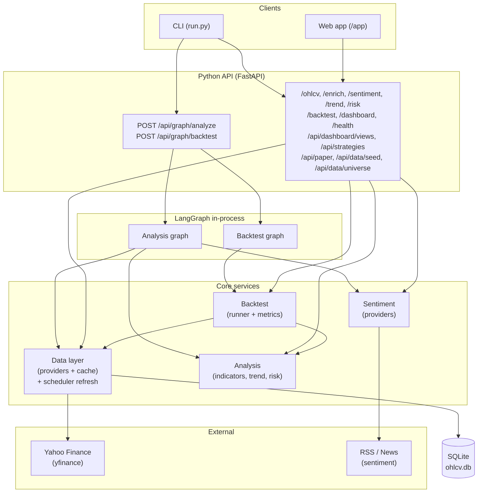
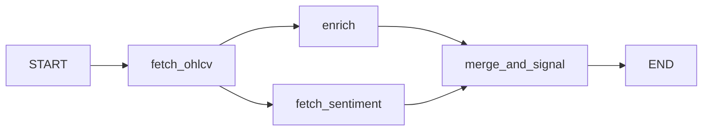
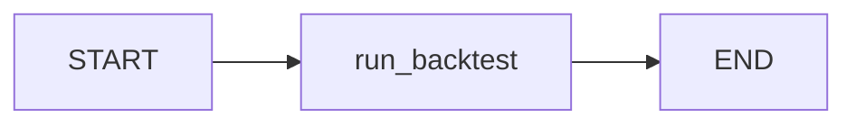
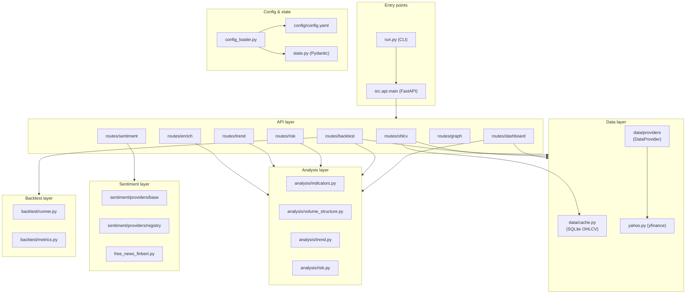
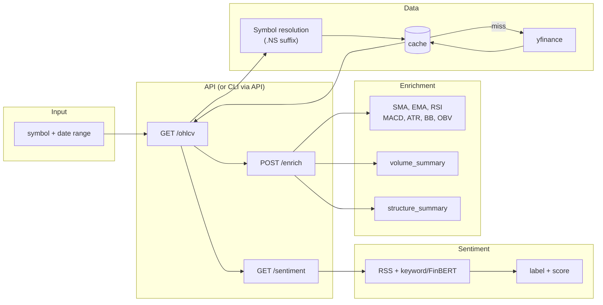
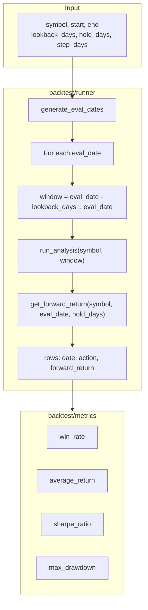
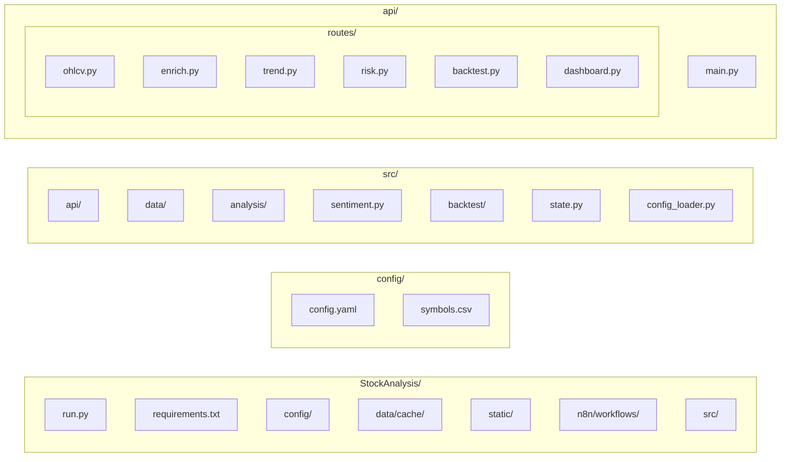

# Stock Analysis Agent — Architecture

LangGraph-orchestrated agent for **Indian market (NSE/BSE)** daily chart analysis: free data (yfinance), technical indicators, sentiment, and buy/sell/hold signals with backtesting. Orchestration runs in-process via **LangGraph** (replacing the previous n8n setup).

---

## High-level system overview

- **CLI** and **Web app** call the API directly (legacy routes and/or graph endpoints).
- **Orchestration** is done by **LangGraph** in-process: **POST /api/graph/analyze** and **POST /api/graph/backtest**.
- **API** uses config-driven **data**, **analysis**, **sentiment**, and **backtest** services; data is cached in SQLite.
- **Data refresh** is handled by the app’s **scheduler** (APScheduler), at a configurable interval, OHLCV for all universe symbols is refreshed and written to the cache.
- **App DB** (`data/app.db`) stores dashboard views, strategies, symbol universe, paper portfolios/snapshots, and backtest run history.

---

## LangGraph in the architecture

LangGraph runs inside the FastAPI process. No separate orchestration server is required.

### Graph endpoints

- **POST /api/graph/analyze** — Body: `{ "symbol": "RELIANCE", "days": 90 }`. Runs the analysis graph (OHLCV → enrich + sentiment in parallel → merge and signal). Returns `symbol`, `signal`, `reason`, `enrich_result`, `sentiment_result`, etc.
- **POST /api/graph/backtest** — Body: same as **POST /api/backtest**. Returns same shape (metrics, rows, strategy, by_symbol, run_id).

### Analysis graph (LangGraph)

### Backtest graph (LangGraph)

Graph code: `src/graph/` (state, analysis_graph, backtest_graph); routes: `src/api/routes/graph.py`. Legacy n8n workflow JSONs remain in `n8n/workflows/` for reference (deprecated).

### API endpoints (overview)

- **Dashboard**: `GET /dashboard` — always reads from DB/cache (no response caching); returns per-symbol indicators, signal, and **data_duration_days** (number of days of OHLCV stored for that symbol). Dashboard views: `GET/POST /api/dashboard/views`, `GET/PUT/DELETE /api/dashboard/views/:id` — persist/restore column config.
- **Strategies**: `GET/POST /api/strategies`, `GET/PUT/DELETE /api/strategies/:id`, `POST /api/strategies/:id/set-default` — CRUD and global default.
- **Paper trading**: `GET/POST /api/paper/portfolios`, `GET/PUT/DELETE /api/paper/portfolios/:id`, positions and `POST .../run`, `GET .../snapshots`.
- **Data**: `POST /api/data/seed` — batch pre-seed OHLCV; **POST /api/data/refresh-symbol** — refresh one symbol (cross-checks cache, fetches only missing date ranges; used by dashboard for one-by-one refresh with per-row spinner). Yahoo provider chunks requests at 365 days to avoid 1-year API limits. `GET/POST/DELETE /api/data/universe` — list/add/remove symbols.

---

## Component layers

---

## Data flow (analyse path)

End-to-end path used by both the API and the CLI `analyze` command:

---

## Backtest flow

Used by `POST /backtest` and the graph backtest workflow:

Strategy logic: if a strategy’s `params` include `buy_rule` and/or `sell_rule`, the **rule engine** (`src/analysis/rule_engine.py`) evaluates them; otherwise the built-in RSI/MACD/SMA rules are used. Rules use indicator names, flags, and operators (`<`, `<=`, `>`, `>=`, `==`, `!=`, `and`, `or`, `not`) in a TradingView Pine–style format. See **docs/BACKTEST_RULES.md** and **GET /backtest/rule-schema** for the full schema.

**Backtest history**: Every `POST /backtest` run is persisted in `backtest_runs` (app.db). **GET /backtest/history** lists runs (optional `limit`, `offset`, `symbol`, `strategy_id`); **GET /backtest/history/{run_id}** returns a full run (same shape as POST response) so the UI can display it. The Backtest tab includes a History section to list and view past runs.

---

## Project layout

| Path | Purpose |
|------|--------|
| `run.py` | CLI: `analyze`, `backtest`, `analyze-graph`, `backtest-graph` (calls API) |
| `config/config.yaml` | Providers, indicators, backtest defaults, API port |
| `config/symbols.csv` | symbol → yahoo_symbol, company_name |
| `data/cache/ohlcv.db` | SQLite OHLCV cache |
| `data/app.db` | App DB: dashboard views, strategies, universe, paper portfolios, backtest runs |
| `config/nifty50.csv` | Nifty 50 symbol list (default universe) |
| `static/` | Web app (index.html, app.js, styles.css) |
| `n8n/workflows/` | Legacy n8n workflow JSONs (deprecated; use graph endpoints) |
| `src/api/main.py` | FastAPI app, lifespan, CORS, static mount, scheduler start/stop |
| `src/api/routes/*` | Route handlers (ohlcv, enrich, backtest, graph, dashboard, dashboard_views, strategies, paper, data) |
| `src/data/` | Cache + data provider (yfinance) + universe (universe.py) |
| `src/db/` | App DB schema and CRUD (app_db.py) |
| `src/scheduler.py` | APScheduler for periodic OHLCV refresh |
| `src/paper/` | Paper trading engine |
| `src/analysis/` | Indicators, volume/structure, trend, risk |
| `src/sentiment/` | Sentiment provider (RSS + keyword/FinBERT) |
| `src/backtest/` | Runner + metrics |
| `src/state.py` | Pydantic models (config, Signal, SentimentResult) |
| `src/config_loader.py` | Load YAML + env overrides → AppConfig |

---

## Configuration and env overrides

Config is loaded from `config/config.yaml` and validated with Pydantic (`src/state.AppConfig`). Refresh (scheduler) options in config: `refresh.refresh_enabled`, `refresh.refresh_interval_minutes`, `refresh.refresh_lookback_days`. Environment overrides:

- `DATA_PROVIDER` — e.g. `yfinance`
- `SENTIMENT_PROVIDER` — e.g. `free_news_finbert`
- `CACHE_DIR` — cache directory path
- `API_PORT` — API server port
- `API_BASE` — used by CLI to call the API (e.g. `http://localhost:8000`)

---

## Summary

- **Single backend**: One FastAPI app serves REST endpoints, static web app, and graph endpoints; used by CLI and web.
- **Data refresh**: Scheduler (APScheduler) runs at a configurable interval to refresh OHLCV for all universe symbols; universe is stored in app DB and seeded from config/nifty50.csv when empty.
- **LangGraph**: Orchestrates analysis (OHLCV → enrich + sentiment in parallel → merge and signal) and backtest via **POST /api/graph/analyze** and **POST /api/graph/backtest** in-process; no separate orchestration server.
- **Layers**: API → Data (providers + SQLite cache + universe), App DB (views, strategies, paper), Analysis, Sentiment, Backtest, Paper engine; Scheduler refreshes cache from universe; `src/graph/` for LangGraph workflows.
- **Config**: YAML + env; all behaviour (providers, indicator params, backtest defaults) is config-driven.
