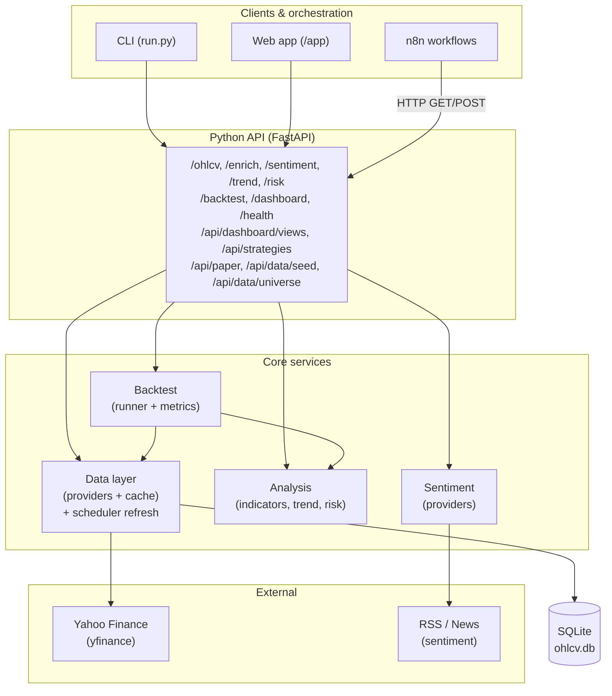
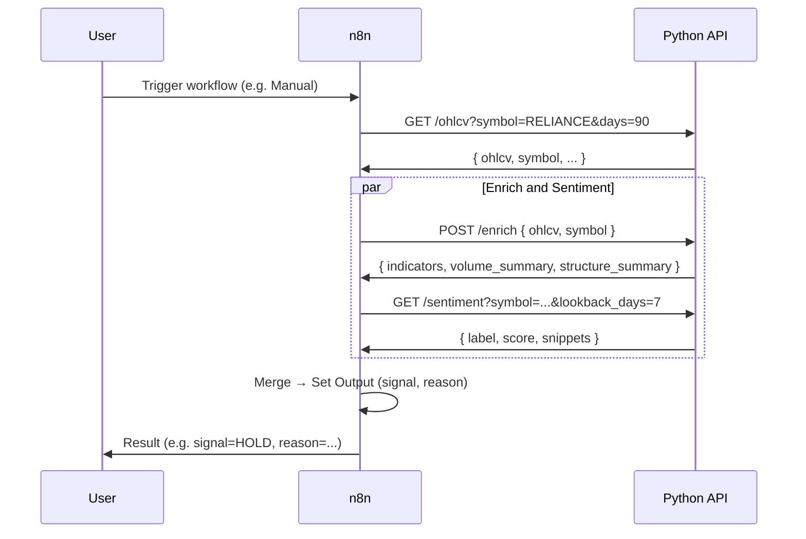
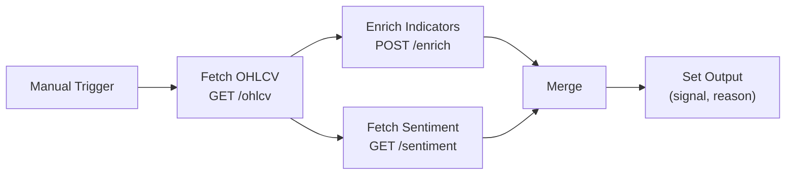
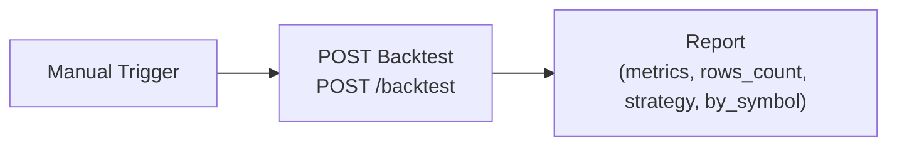
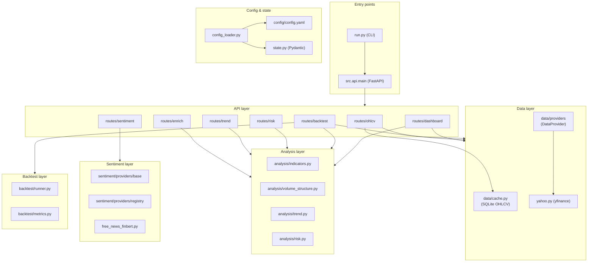
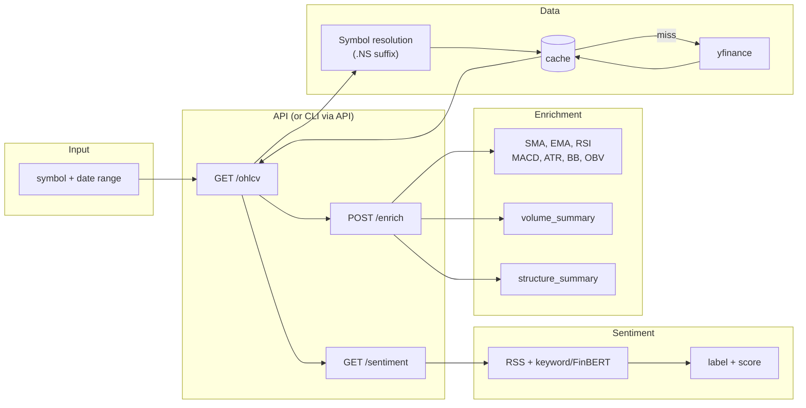
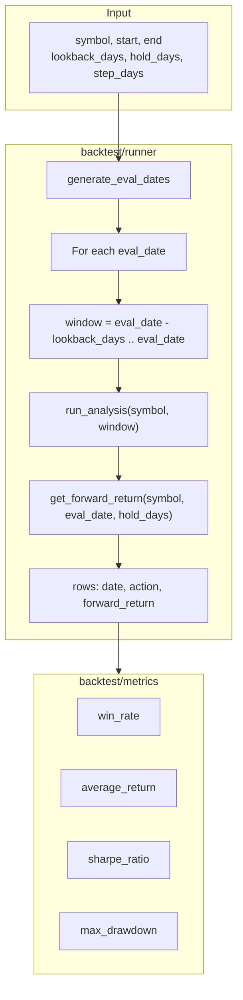
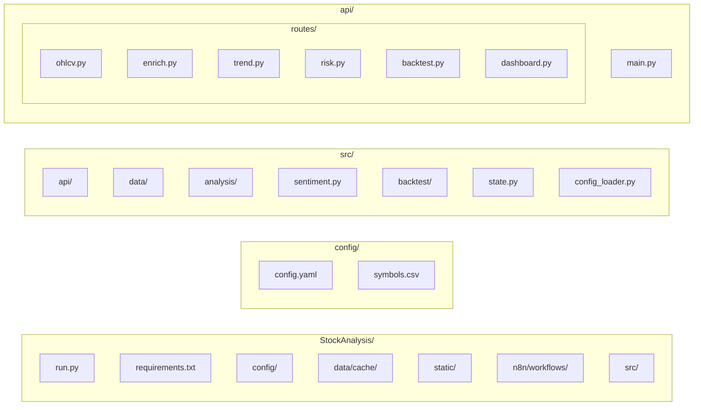

# Stock Analysis Agent — Architecture

n8n-orchestrated agent for **Indian market (NSE/BSE)** daily chart analysis: free data (yfinance), technical indicators, sentiment, and buy/sell/hold signals with backtesting.

---

## High-level system overview

- **CLI** and **Web app** call the API directly.
- **n8n** orchestrates multi-step workflows by calling the same API (e.g. OHLCV → Enrich + Sentiment → Merge → Signal).
- **API** uses config-driven **data**, **analysis**, **sentiment**, and **backtest** services; data is cached in SQLite.
- **Data refresh** is handled by the app’s **scheduler** (APScheduler), not n8n: at a configurable interval, OHLCV for all universe symbols is refreshed and written to the cache.
- **App DB** (`data/app.db`) stores dashboard views, strategies, symbol universe, paper portfolios/snapshots, and backtest run history.

---

## n8n in the architecture

n8n runs as a separate process and uses the Stock Analysis API as an HTTP backend. Set `API_BASE` (or use `http://127.0.0.1:8000` / `http://host.docker.internal:8000` if n8n is in Docker).

### n8n ↔ API flow

### Stock Analysis workflow (n8n)

### Stock Backtest workflow (n8n)

- **Backtest request** may include optional `strategy_id` (saved strategy) or `symbols` + `strategy_assignments` for multi-symbol runs. If omitted, the global default strategy is used.
- **Response** includes `metrics`, `rows`, `strategy` (name, description), and optionally `by_symbol` (per-symbol metrics).

Workflow JSONs: `n8n/workflows/stock_analysis_workflow.json`, `n8n/workflows/stock_backtest_workflow.json`.

### New API endpoints (re-architecture)

- **Dashboard views**: `GET/POST /api/dashboard/views`, `GET/PUT/DELETE /api/dashboard/views/:id` — persist/restore column config.
- **Strategies**: `GET/POST /api/strategies`, `GET/PUT/DELETE /api/strategies/:id`, `POST /api/strategies/:id/set-default` — CRUD and global default.
- **Paper trading**: `GET/POST /api/paper/portfolios`, `GET/PUT/DELETE /api/paper/portfolios/:id`, positions and `POST .../run`, `GET .../snapshots`.
- **Data**: `POST /api/data/seed` — pre-seed OHLCV for universe; `GET/POST/DELETE /api/data/universe` — list/add/remove symbols.

---

## Component layers

---

## Data flow (analyse path)

End-to-end path used by both the API (and thus n8n) and the CLI `analyze` command:

---

## Backtest flow

Used by `POST /backtest` and the n8n backtest workflow:

Strategy logic: if a strategy’s `params` include `buy_rule` and/or `sell_rule`, the **rule engine** (`src/analysis/rule_engine.py`) evaluates them; otherwise the built-in RSI/MACD/SMA rules are used. Rules use indicator names, flags, and operators (`<`, `<=`, `>`, `>=`, `==`, `!=`, `and`, `or`, `not`) in a TradingView Pine–style format. See **docs/BACKTEST_RULES.md** and **GET /backtest/rule-schema** for the full schema.

**Backtest history**: Every `POST /backtest` run is persisted in `backtest_runs` (app.db). **GET /backtest/history** lists runs (optional `limit`, `offset`, `symbol`, `strategy_id`); **GET /backtest/history/{run_id}** returns a full run (same shape as POST response) so the UI can display it. The Backtest tab includes a History section to list and view past runs.

---

## Project layout

| Path | Purpose |
|------|--------|
| `run.py` | CLI: `analyze`, `backtest` (calls API) |
| `config/config.yaml` | Providers, indicators, backtest defaults, API port |
| `config/symbols.csv` | symbol → yahoo_symbol, company_name |
| `data/cache/ohlcv.db` | SQLite OHLCV cache |
| `data/app.db` | App DB: dashboard views, strategies, universe, paper portfolios, backtest runs |
| `config/nifty50.csv` | Nifty 50 symbol list (default universe) |
| `static/` | Web app (index.html, app.js, styles.css) |
| `n8n/workflows/` | n8n workflow JSONs (analysis, backtest) |
| `src/api/main.py` | FastAPI app, lifespan, CORS, static mount, scheduler start/stop |
| `src/api/routes/*` | Route handlers (ohlcv, enrich, backtest, dashboard, dashboard_views, strategies, paper, data) |
| `src/data/` | Cache + data provider (yfinance) + universe (universe.py) |
| `src/db/` | App DB schema and CRUD (app_db.py) |
| `src/scheduler.py` | APScheduler for periodic OHLCV refresh |
| `src/paper/` | Paper trading engine |
| `src/analysis/` | Indicators, volume/structure, trend, risk |
| `src/sentiment/` | Sentiment provider (RSS + keyword/FinBERT) |
| `src/backtest/` | Runner + metrics |
| `src/state.py` | Pydantic models (config, Signal, SentimentResult) |
| `src/config_loader.py` | Load YAML + env overrides → AppConfig |

---

## Configuration and env overrides

Config is loaded from `config/config.yaml` and validated with Pydantic (`src/state.AppConfig`). Refresh (scheduler) options in config: `refresh.refresh_enabled`, `refresh.refresh_interval_minutes`, `refresh.refresh_lookback_days`. Environment overrides:

- `DATA_PROVIDER` — e.g. `yfinance`
- `SENTIMENT_PROVIDER` — e.g. `free_news_finbert`
- `CACHE_DIR` — cache directory path
- `API_PORT` — API server port
- `API_BASE` — used by CLI and n8n to call the API (e.g. `http://localhost:8000`)

---

## Summary

- **Single backend**: One FastAPI app serves REST endpoints, static web app, and is used by both CLI and n8n.
- **Data refresh**: Scheduler (APScheduler) runs at a configurable interval to refresh OHLCV for all universe symbols; universe is stored in app DB and seeded from config/nifty50.csv when empty.
- **n8n**: Orchestrates analysis (OHLCV → Enrich + Sentiment → Merge → Output) and backtest (POST /backtest, optional strategy_id; response includes strategy, by_symbol) via HTTP; no direct DB access.
- **Layers**: API → Data (providers + SQLite cache + universe), App DB (views, strategies, paper), Analysis, Sentiment, Backtest, Paper engine; Scheduler refreshes cache from universe.
- **Config**: YAML + env; all behaviour (providers, indicator params, backtest defaults) is config-driven.
